# Escuela Politécnica Nacional

**Integrantes:**  
Javier Angulo, Jotcelyn Godoy, Javier Quilumba, Cristian Robles, Jonathan Tipán

**Fecha:** 10/07/2026  
**Paralelo:** GR2SW

---

## 10.6 Aplicación del algoritmo Apriori en Weka a un conjunto de datos del mundo real.

**Objetivo:**  
**Ejecutar el algoritmo Apriori en un conjunto de datos dado (Tabla 10.3) y, por lo tanto, elegir la mejor regla de asociación usando Weka.**

---

1. En un Excel se debe realizar el siguiente formato usando la tabla de transacciones dada.

  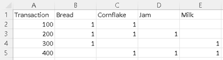

2. Guardar con el nombre "DailyItem Dataset" en el Escritorio como un archivo CSV (delimitado por comas).

  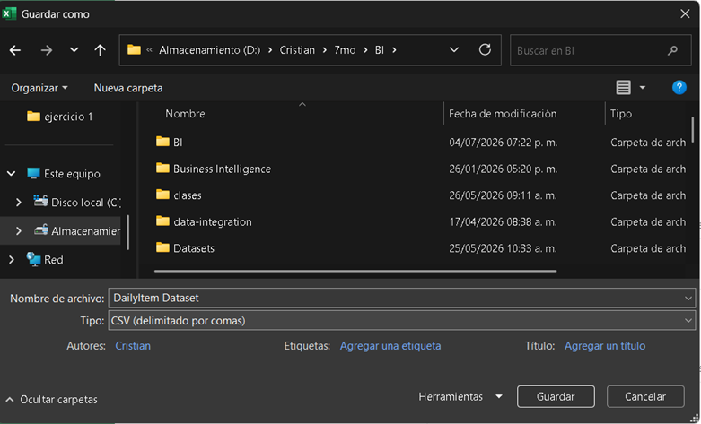

3. En Weka, en el explorador, en la ventana de "Preprocess", buscamos el archivo después de dar clic en "Open file" y lo abrimos.

  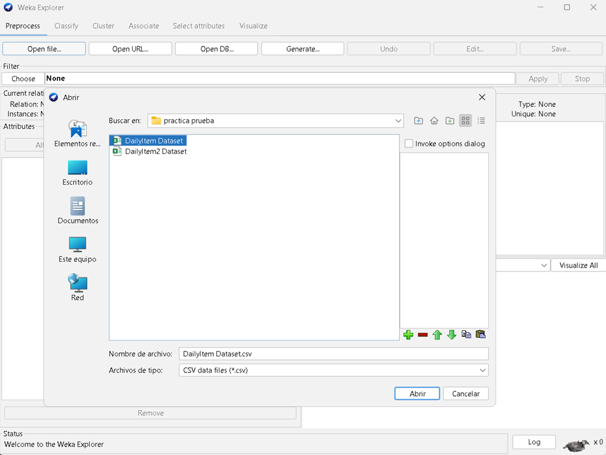

**Datos cargados:**

  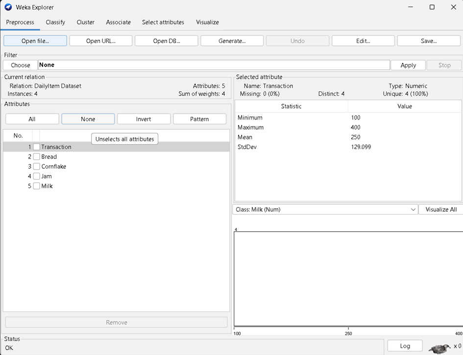

4. Como no se puede aplicar la asociación de datos directamente en datos numéricos, en el botón "Choose" seleccionamos filtros, luego "Unsupervised", entramos a "attribute" y seleccionamos "Numeric to Nominal". Finalmente, se aplican los cambios.

  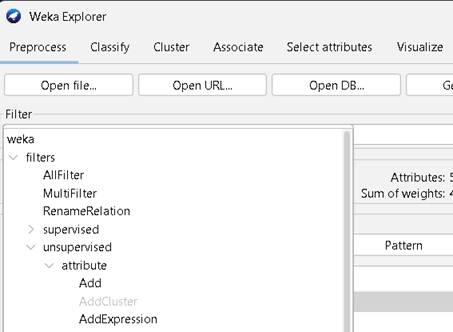

**Búsqueda de filtro:**

  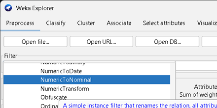

**Aplicando el filtro obtenemos esto:**

  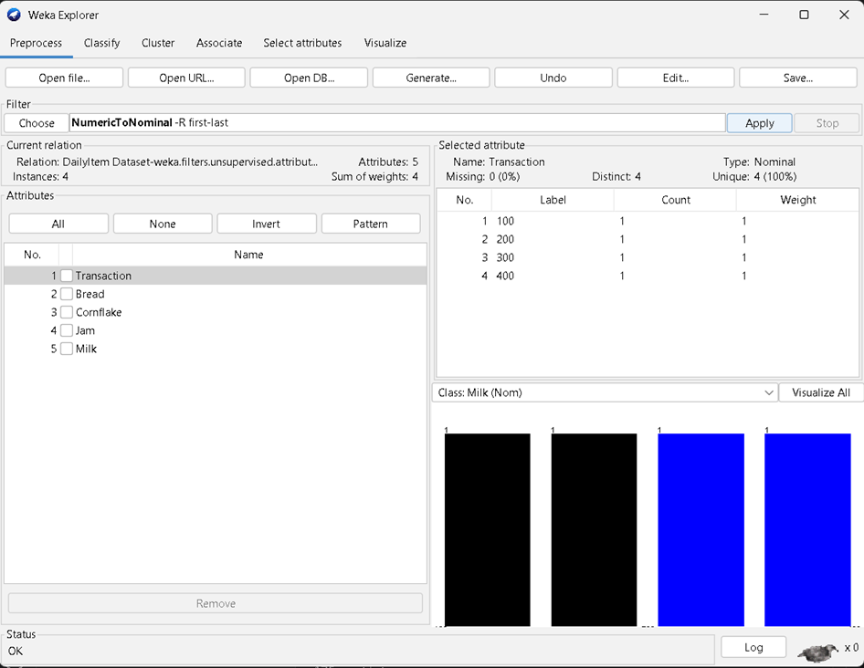

5. Eliminamos los atributos que no necesitamos; en este caso se lo hará con "Transaction", primero se selecciona dicho check en el menú de la izquierda y luego se presiona el botón de "Remove".

  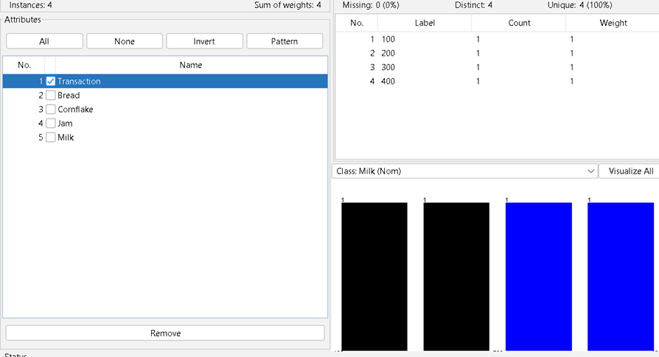

**El atributo "Transaction" eliminado:**

  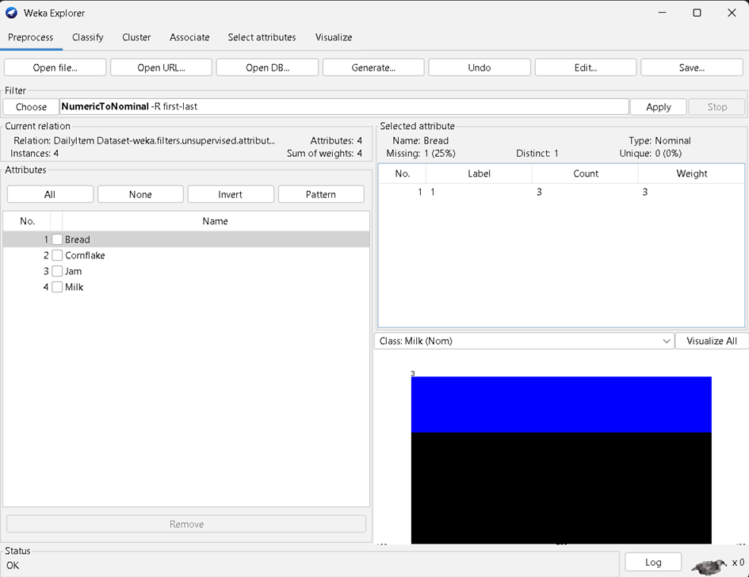

6. Una vez "limpios" los datos cargados, seleccionamos la pestaña de "Associate" y, en "Choose", seleccionamos la opción "Apriori" de "associations".

  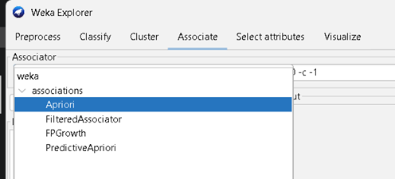

7. Ahora, para ingresar al editor de objetos generales, se da clic en el campo de "Apriori" y se realizan cambios en algunos campos según lo requerido:

- lowerBoundMinSupport = 0.5
- metricType = Confidence
- minMetric = 0.75
- numRules = 10

Luego se selecciona "OK".

  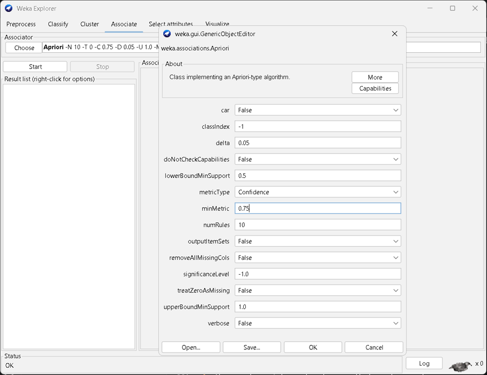

8. Finalmente, se selecciona el botón de "Start" y se obtienen los resultados en la pantalla derecha.

  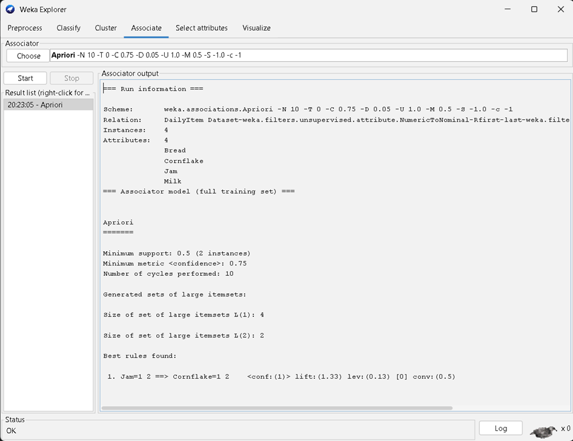

9. Ahora podemos interpretar los resultados, observando la imagen respectiva a las reglas encontradas.

  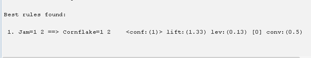

**Se puede resumir en que la mejor regla encontrada es:**

- Jam -> Cornflakes

El orden dado por el porcentaje de mayor a menor, que en este caso nos arroja que cuando se compra Jam (Mermelada) hay un 100% de confianza (conf: 1) de que también se compre Cornflakes (Hojuelas de maíz), coincidiendo perfectamente con lo estudiado antes de forma manual.

---

## 10.7 Aplicación del Algoritmo Apriori en Weka en un Conjunto de Datos Real Más Grande

**Objetivo:**  
**Ejecutar el algoritmo Apriori en un conjunto de datos (dataset) dado con soporte y confianza predefinidos, y luego interpretar el resultado.**

---

1. En un Excel se debe realizar el siguiente formato y guardarse como un archivo CSV.

  

2. Guardar con el nombre "DailyItmen2 Dataset" en el Escritorio como un archivo CSV (delimitado por comas).

  

3. En Weka, en el explorador, en la ventana de "Preprocess", buscamos el archivo después de dar clic en "Open file" y lo abrimos.

  

**Datos cargados:**

  

4. Como no se puede aplicar la asociación de datos directamente en datos numéricos, en el botón "Choose" seleccionamos filtros, luego "Unsupervised" y "Numeric to Nominal". Finalmente, se aplican los cambios.

  

**Búsqueda de filtro**

  

**Aplicando el filtro obtenemos esto:**

  

5. Eliminamos los atributos que no necesitamos; en este caso se lo hará con "Transaction", primero se selecciona dicho check en el menú de la izquierda y luego se presiona el botón de "Remove".

  

**El atributo "Transaction" eliminado**

  

6. Una vez "limpios" los datos cargados, seleccionamos la pestaña de "Associate" y, en "Choose", seleccionamos la opción "Apriori" de "association".

  

7. Ahora, para ingresar al editor de objetos generales, se da clic en el campo de "Apriori" y se realizan cambios en algunos campos:

- lowerCoundMinSupport = 0.5
- metricType = Confidence
- minMetric = 0.75

Luego se selecciona "OK".

  

8. Finalmente, se selecciona el botón de "Start" y se obtienen los resultados.

  

9. Ahora podemos interpretar los resultados; observando la imagen respectiva a las reglas encontradas.

  

**Se puede resumir en que las mejores reglas son:**

- Cornflake -> Jam
- Jam -> Bread
- Bread -> Jam
- Jam -> Cornflake

El orden dado por el porcentaje de mayor a menor, ordenados de manera descendente.

---

## 10.8

## 10.9