# Escuela Politécnica Nacional

**Integrantes:**  
Javier Angulo, Jotcelyn Godoy, Javier Quilumba, Cristian Robles, Jonathan Tipán

**Fecha:** 10/07/2026  
**Paralelo:** GR2SW

---

## 10.6 Aplicación del algoritmo Apriori en Weka a un conjunto de datos del mundo real.

**Objetivo:**  
**Ejecutar el algoritmo Apriori en un conjunto de datos dado (Tabla 10.3) y, por lo tanto, elegir la mejor regla de asociación usando Weka.**

---

1. En Microsoft Excel, se debe tabular la información de la base de datos de transacciones de la tienda (Tabla 10.3) con el formato binario (1 para presencia, celda vacía para ausencia) tal como se muestra en la siguiente imagen:

  

2. Guardar el archivo en el Escritorio con el nombre **"DailyItem Dataset"** con el tipo **CSV (delimitado por comas)**.

  

3. Abrir la aplicación de Weka para ingresar al **Weka GUI Chooser Panel** y hacer clic en la opción **"Explorer"**.

  

4. En la pestaña de **"Preprocess"**, hacer clic en el botón **"Open file..."**, buscar en el Escritorio el archivo **"DailyItem Dataset.csv"** y abrirlo. Una vez cargados los datos, se visualizarán todos los atributos en la interfaz.

  

5. Dado que Weka por defecto interpreta todas las columnas con números como datos numéricos, y la minería de reglas de asociación no puede aplicarse directamente a variables numéricas, debemos convertir estos datos a tipo nominal. 

   Para esto, justo debajo de "Open file..." seleccionamos el botón **"Choose"**, seguimos la ruta **filters ➔ unsupervised ➔ attribute ➔ NumericToNominal** y presionamos en él.

  

6. Una vez que el filtro `NumericToNominal` está configurado en la barra de filtros, hacemos clic en el botón **"Apply"** para aplicar la transformación sobre todas las columnas del dataset.

  

7. Para realizar un correcto análisis de reglas de asociación, debemos remover aquellos atributos que no aporten valor al patrón de compra. En este caso, el atributo de identificación **"Transaction"** no juega ningún rol en la minería de asociaciones, por lo que es mejor removerlo. 
   
   Seleccionamos la casilla correspondiente a **"Transaction"** en la parte izquierda y hacemos clic en el botón **"Remove"**.

  

8. Con los datos preprocesados y limpios, seleccionamos la pestaña **"Associate"** en la barra superior. Hacemos clic en el botón **"Choose"** y seleccionamos el algoritmo **"Apriori"** bajo la carpeta de *associations*.

  

9. Para modificar los parámetros del algoritmo, hacemos clic izquierdo directamente sobre la barra de texto del campo **"Apriori"**. Esto abrirá la ventana del **Generic Object Editor** para ingresar los siguientes valores de configuración:

   - **lowerBoundMinSupport:** `0.5` *(Representa el umbral de soporte mínimo del 50%, equivalente a 2 transacciones en este conjunto)*
   - **metricType:** `Confidence` *(Métrica de evaluación basada en la Confianza)*
   - **minMetric:** `0.75` *(Confianza mínima del 75%)*
   - **numRules:** `10` *(Cantidad máxima de reglas que el algoritmo intentará encontrar)*

   Una vez configurados los parámetros, presionamos en el botón **"OK"**.

  

10. Finalmente, hacemos clic en el botón **"Start"** ubicado en el panel de control de la izquierda para procesar el algoritmo.

  

---

### **Parte 3: Análisis e Interpretación de Resultados**

11. El resultado del algoritmo aparecerá en la ventana de **"Associator output"** en la parte derecha de Weka.

  

#### **Análisis Detallado:**

* **Soporte Mínimo:** Configurado en `0.5`, lo que equivale a un mínimo de **2 transacciones**.
* **Confianza Mínima:** Configurada en `0.75` (75%).
* **Conjuntos de Ítems Frecuentes Encontrados:**
  * **L(1) (Tamaño de conjunto de 1 ítem):** Se encontraron 4 conjuntos frecuentes (Bread, Cornflakes, Jam, Milk).
  * **L(2) (Tamaño de conjunto de 2 ítems):** Se encontraron 2 conjuntos frecuentes que cumplen con el soporte mínimo.

#### **Mejor Regla de Asociación Encontrada:**

Tras evaluar las métricas, la mejor regla de asociación obtenida con este conjunto de datos es:

$$\text{Jam=1 } (2) \implies \text{Cornflakes=1 } (2) \quad \text{conf:(1)}$$

* **Interpretación:** 
  La regla **Jam ➔ Cornflakes** cuenta con un **100% de certeza predictiva (confianza = 1.0)**. Esto significa que en el $100\%$ de los casos en que un cliente compró Mermelada (*Jam*), también compró Hojuelas de Maíz (*Cornflakes*). 
  
  Este resultado coincide exactamente con el análisis teórico y los cálculos matemáticos manuales que realizamos previamente en la sección de fundamentos del algoritmo Apriori.

---

## 10.7 Aplicación del Algoritmo Apriori en Weka en un Conjunto de Datos Real Más Grande

**Objetivo:**  
**Ejecutar el algoritmo Apriori en un conjunto de datos (dataset) dado con soporte y confianza predefinidos, y luego interpretar el resultado.**

---

1. En un Excel se debe realizar el siguiente formato y guardarse como un archivo CSV.

  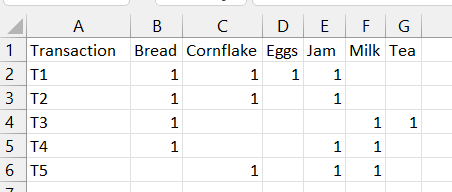

2. Guardar con el nombre "DailyItmen2 Dataset" en el Escritorio como un archivo CSV (delimitado por comas).

  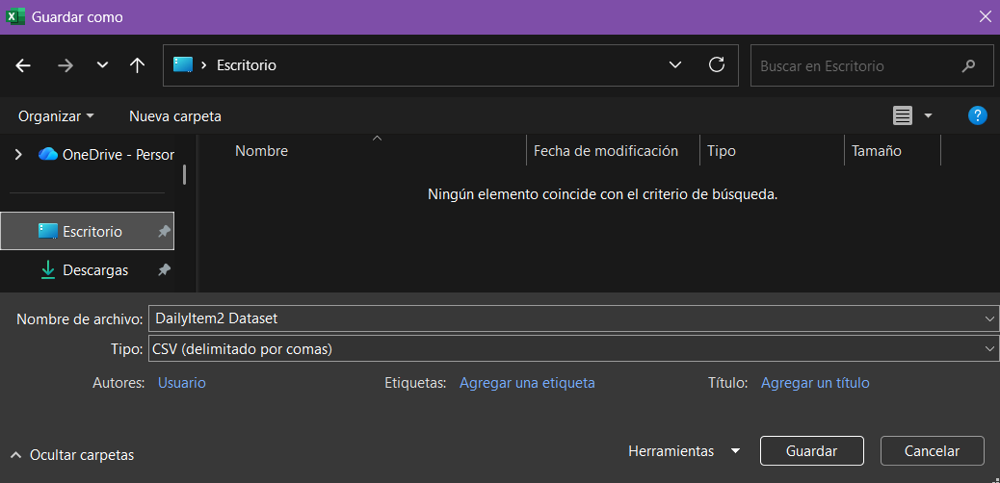

3. En Weka, en el explorador, en la ventana de "Preprocess", buscamos el archivo después de dar clic en "Open file" y lo abrimos.

  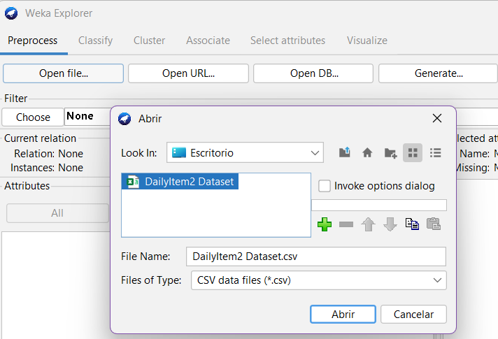

**Datos cargados:**

  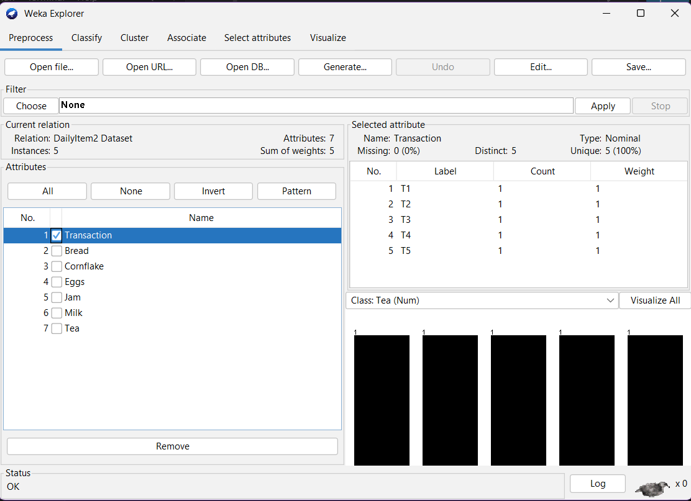

4. Como no se puede aplicar la asociación de datos directamente en datos numéricos, en el botón "Choose" seleccionamos filtros, luego "Unsupervised" y "Numeric to Nominal". Finalmente, se aplican los cambios.

  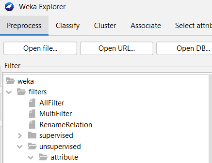

**Búsqueda de filtro**

  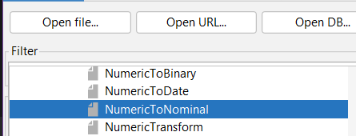

**Aplicando el filtro obtenemos esto:**

  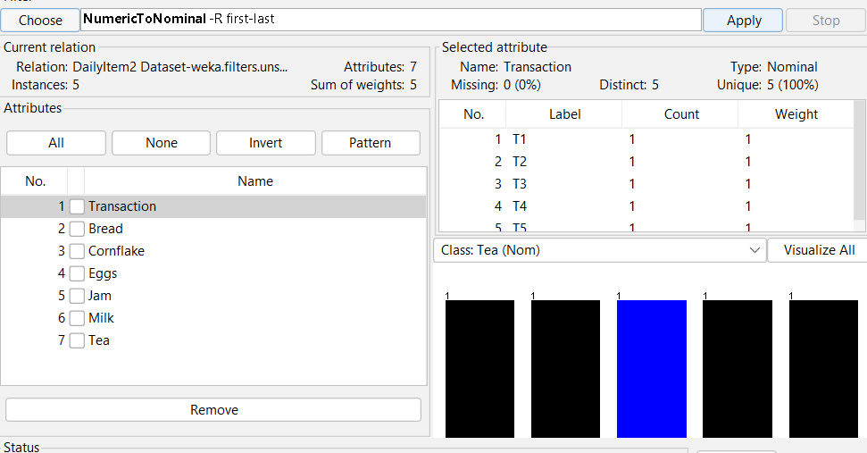

5. Eliminamos los atributos que no necesitamos; en este caso se lo hará con "Transaction", primero se selecciona dicho check en el menú de la izquierda y luego se presiona el botón de "Remove".

  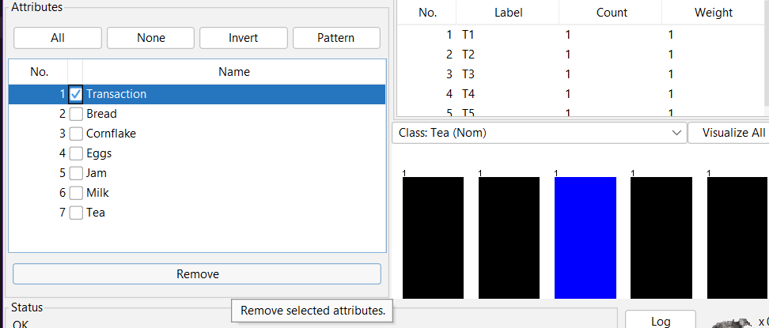

**El atributo "Transaction" eliminado**

  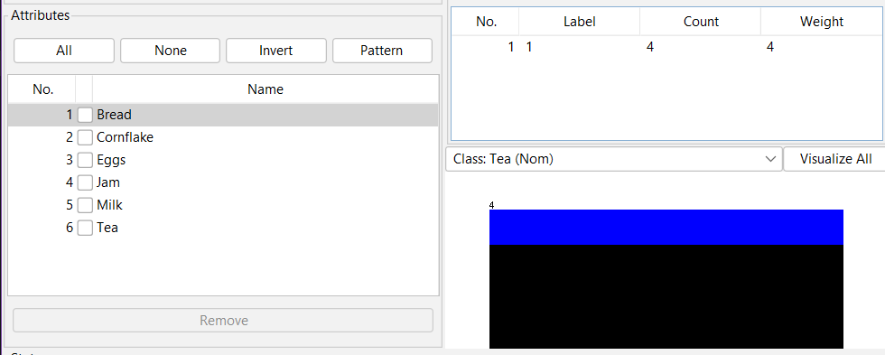

6. Una vez "limpios" los datos cargados, seleccionamos la pestaña de "Associate" y, en "Choose", seleccionamos la opción "Apriori" de "association".

  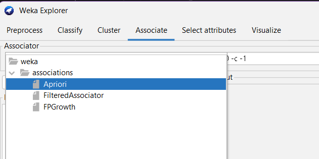

7. Ahora, para ingresar al editor de objetos generales, se da clic en el campo de "Apriori" y se realizan cambios en algunos campos:

- lowerCoundMinSupport = 0.5
- metricType = Confidence
- minMetric = 0.75

Luego se selecciona "OK".

  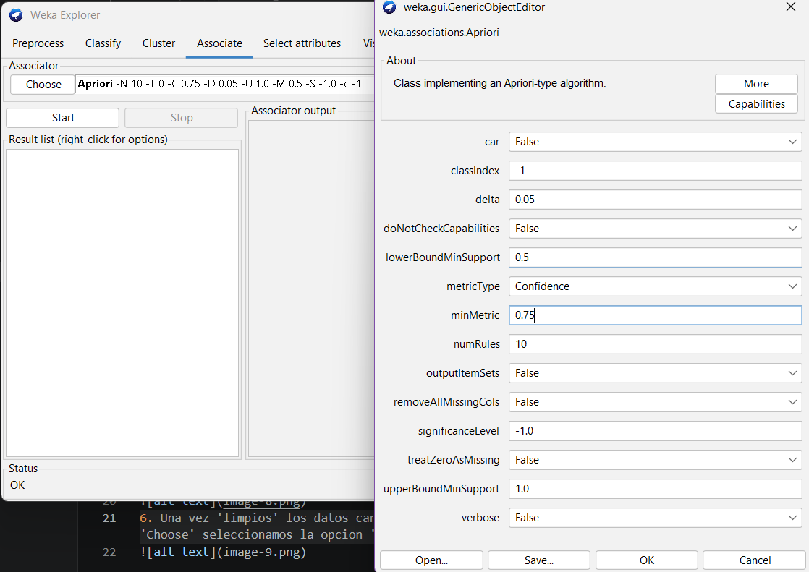

8. Finalmente, se selecciona el botón de "Start" y se obtienen los resultados.

  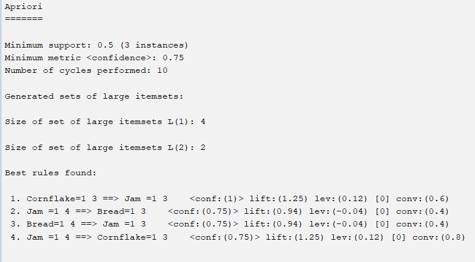

9. Ahora podemos interpretar los resultados; observando la imagen respectiva a las reglas encontradas.

  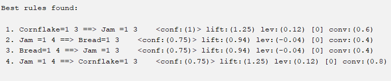

**Se puede resumir en que las mejores reglas son:**

- Cornflake -> Jam
- Jam -> Bread
- Bread -> Jam
- Jam -> Cornflake

El orden dado por el porcentaje de mayor a menor, ordenados de manera descendente.

---

## 10.8

## 10.9