# Escuela Politécnica Nacional

**Integrantes:**  
Javier Angulo, Jotcelyn Godoy, Javier Quilumba, Cristian Robles, Jonathan Tipán

**Fecha:** 10/07/2026  
**Paralelo:** GR2SW

---

## 10.6 Aplicación del algoritmo Apriori en Weka a un conjunto de datos del mundo real.

**Objetivo:**  
**Ejecutar el algoritmo Apriori en un conjunto de datos dado (Tabla 10.3) y, por lo tanto, elegir la mejor regla de asociación usando Weka.**

---

1. En un Excel se debe realizar el siguiente formato usando la tabla de transacciones dada.

  

2. Guardar con el nombre "DailyItem Dataset" en el Escritorio como un archivo CSV (delimitado por comas).

  

3. En Weka, en el explorador, en la ventana de "Preprocess", buscamos el archivo después de dar clic en "Open file" y lo abrimos.

  

**Datos cargados:**

  

4. Como no se puede aplicar la asociación de datos directamente en datos numéricos, en el botón "Choose" seleccionamos filtros, luego "Unsupervised", entramos a "attribute" y seleccionamos "Numeric to Nominal". Finalmente, se aplican los cambios.

  

**Búsqueda de filtro:**

  

**Aplicando el filtro obtenemos esto:**

  

5. Eliminamos los atributos que no necesitamos; en este caso se lo hará con "Transaction", primero se selecciona dicho check en el menú de la izquierda y luego se presiona el botón de "Remove".

  

**El atributo "Transaction" eliminado:**

  

6. Una vez "limpios" los datos cargados, seleccionamos la pestaña de "Associate" y, en "Choose", seleccionamos la opción "Apriori" de "associations".

  

7. Ahora, para ingresar al editor de objetos generales, se da clic en el campo de "Apriori" y se realizan cambios en algunos campos según lo requerido:

- lowerBoundMinSupport = 0.5
- metricType = Confidence
- minMetric = 0.75
- numRules = 10

Luego se selecciona "OK".

  

8. Finalmente, se selecciona el botón de "Start" y se obtienen los resultados en la pantalla derecha.

  

9. Ahora podemos interpretar los resultados, observando la imagen respectiva a las reglas encontradas.

  

**Se puede resumir en que la mejor regla encontrada es:**

- Jam -> Cornflakes

El orden dado por el porcentaje de mayor a menor, que en este caso nos arroja que cuando se compra Jam (Mermelada) hay un 100% de confianza (conf: 1) de que también se compre Cornflakes (Hojuelas de maíz), coincidiendo perfectamente con lo estudiado antes de forma manual.

---

## 10.7 Aplicación del Algoritmo Apriori en Weka en un Conjunto de Datos Real Más Grande

**Objetivo:**  
**Ejecutar el algoritmo Apriori en un conjunto de datos (dataset) dado con soporte y confianza predefinidos, y luego interpretar el resultado.**

---

1. En un Excel se debe realizar el siguiente formato y guardarse como un archivo CSV.

  

2. Guardar con el nombre "DailyItmen2 Dataset" en el Escritorio como un archivo CSV (delimitado por comas).

  

3. En Weka, en el explorador, en la ventana de "Preprocess", buscamos el archivo después de dar clic en "Open file" y lo abrimos.

  

**Datos cargados:**

  

4. Como no se puede aplicar la asociación de datos directamente en datos numéricos, en el botón "Choose" seleccionamos filtros, luego "Unsupervised" y "Numeric to Nominal". Finalmente, se aplican los cambios.

  

**Búsqueda de filtro**

  

**Aplicando el filtro obtenemos esto:**

  

5. Eliminamos los atributos que no necesitamos; en este caso se lo hará con "Transaction", primero se selecciona dicho check en el menú de la izquierda y luego se presiona el botón de "Remove".

  

**El atributo "Transaction" eliminado**

  

6. Una vez "limpios" los datos cargados, seleccionamos la pestaña de "Associate" y, en "Choose", seleccionamos la opción "Apriori" de "association".

  

7. Ahora, para ingresar al editor de objetos generales, se da clic en el campo de "Apriori" y se realizan cambios en algunos campos:

- lowerCoundMinSupport = 0.5
- metricType = Confidence
- minMetric = 0.75

Luego se selecciona "OK".

  

8. Finalmente, se selecciona el botón de "Start" y se obtienen los resultados.

  

9. Ahora podemos interpretar los resultados; observando la imagen respectiva a las reglas encontradas.

  

**Se puede resumir en que las mejores reglas son:**

- Cornflake -> Jam
- Jam -> Bread
- Bread -> Jam
- Jam -> Cornflake

El orden dado por el porcentaje de mayor a menor, ordenados de manera descendente.

---

## 10.8 Aplicación del algoritmo Apriori sobre un conjunto de datos numérico

**Objetivo:**  
**Aplicar minería de reglas de asociación sobre las calificaciones de los estudiantes, transformando previamente los atributos numéricos en valores nominales mediante discretización.**

---

1. Se cargó en Weka el archivo con las calificaciones de los estudiantes. El conjunto original contiene los atributos **Roll No.**, **Name**, **MST**, **Quiz**, **Lab**, **ENDSEM**, **Total** y **Grade**, con un total de **9 registros**.

  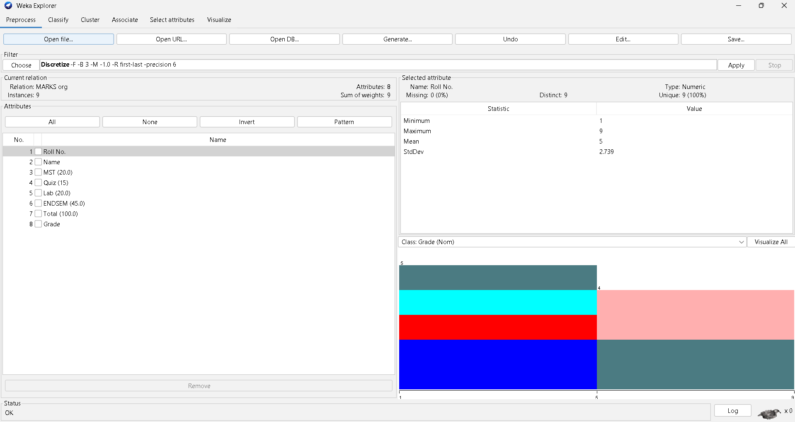

2. Los atributos **Roll No.** y **Name** se eliminaron porque únicamente identifican al estudiante y no aportan información relevante para descubrir asociaciones entre su rendimiento académico. Después de esta limpieza quedaron los siguientes seis atributos:

- MST
- Quiz
- Lab
- ENDSEM
- Total
- Grade

A continuación, se seleccionó el filtro **Unsupervised > Attribute > Discretize**, debido a que los algoritmos de asociación trabajan con atributos nominales y las calificaciones se encontraban almacenadas como valores numéricos.

  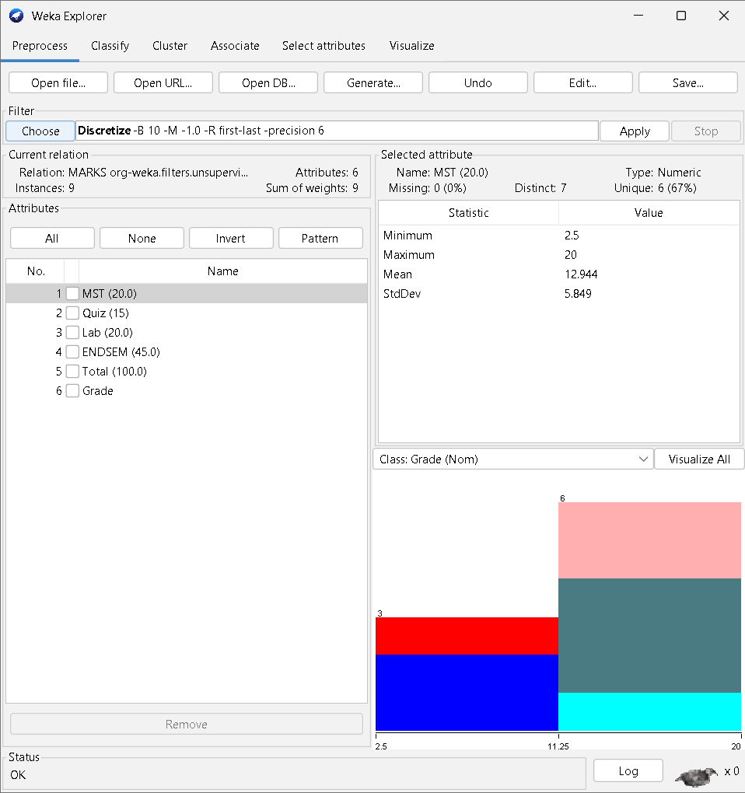

3. En las propiedades del filtro se configuraron **3 intervalos** y se habilitó la opción de **frecuencia igual**. De esta manera, cada atributo numérico fue convertido en tres categorías que representan un nivel bajo, medio o alto de rendimiento.

Después de aplicar el filtro, el atributo **MST** quedó dividido en los siguientes intervalos:

| Intervalo | Rango generado por Weka | Número de estudiantes |
|---|---:|---:|
| Bajo | `(-inf-11.5]` | 3 |
| Medio | `(11.5-16.5]` | 4 |
| Alto | `(16.5-inf)` | 2 |

  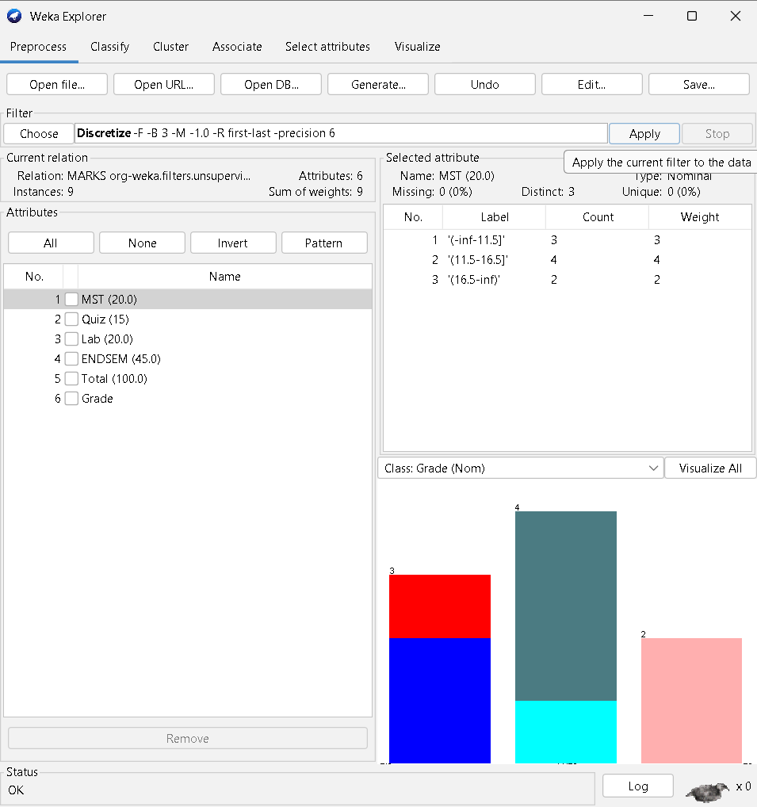

4. Una vez que los atributos fueron convertidos a valores nominales, se ingresó a la pestaña **Associate**, se seleccionó el algoritmo **PredictiveApriori** y se revisó su configuración en el editor de propiedades.

  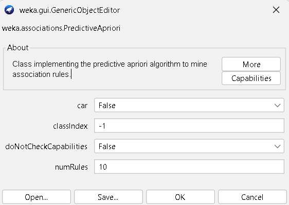

5. Finalmente, se ejecutó el algoritmo y Weka generó reglas de asociación ordenadas según su **exactitud predictiva (`acc`)**.

  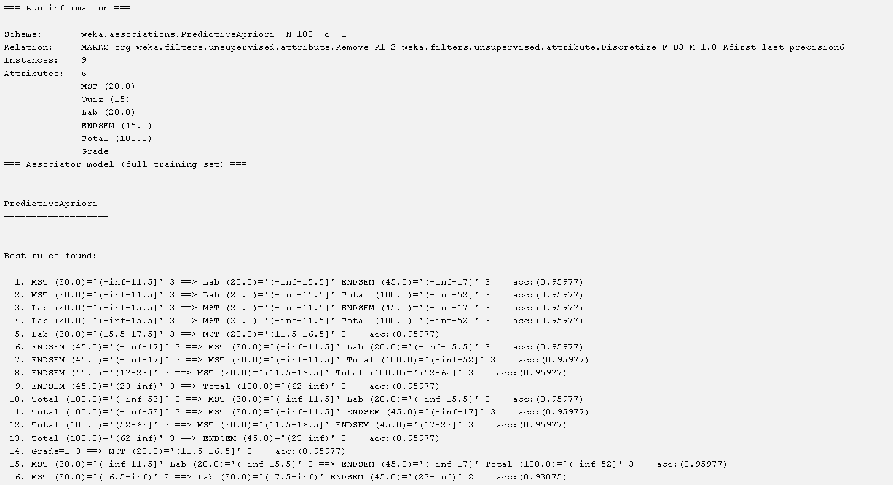

### Análisis de resultados

Entre las reglas más representativas se encontraron las siguientes:

| Regla encontrada | Registros | `acc` | Interpretación |
|---|---:|---:|---|
| `MST = Bajo => Lab = Bajo, ENDSEM = Bajo` | 3 | 0.95977 | Los tres estudiantes con una calificación baja en MST también presentan valores bajos en laboratorio y examen final. |
| `MST = Bajo => Lab = Bajo, Total = Bajo` | 3 | 0.95977 | Un desempeño bajo en MST aparece junto con laboratorio y calificación total bajos. |
| `Lab = Bajo => MST = Bajo, ENDSEM = Bajo` | 3 | 0.95977 | El nivel bajo en laboratorio se relaciona con niveles bajos en MST y ENDSEM. |
| `ENDSEM = Alto => Total = Alto` | 3 | 0.95977 | Los estudiantes ubicados en el intervalo alto del examen final también alcanzan un total alto. |
| `Grade = B => MST = Medio` | 3 | 0.95977 | Todos los registros con nota final B se ubican en el nivel medio de MST. |
| `MST = Alto => Lab = Alto, ENDSEM = Alto` | 2 | 0.93075 | Los estudiantes con MST alto también muestran un rendimiento alto en laboratorio y examen final. |

Los resultados muestran una relación coherente entre las diferentes evaluaciones: los valores bajos tienden a presentarse juntos y los valores altos también se agrupan. En especial, **ENDSEM** y **Total** mantienen una asociación directa, lo cual es razonable porque el examen final constituye una parte importante de la calificación total.

Sin embargo, el conjunto utilizado contiene únicamente **9 estudiantes**. Por esta razón, varias reglas se forman con solo dos o tres registros. Las reglas describen correctamente los datos disponibles, pero no deben interpretarse como conclusiones generales sobre todos los estudiantes sin analizar un conjunto de datos más amplio.

---

## 10.9 Proceso de discretización manual

**Objetivo:**  
**Transformar manualmente las calificaciones numéricas en categorías de rendimiento bajo, medio y alto, aplicar PredictiveApriori y analizar las reglas obtenidas tanto de forma general como orientadas a la calificación final.**

---

1. Se partió de un conjunto con **60 registros** y los atributos **MST**, **Quiz**, **Lab**, **ENDSEM**, **Total** y **Grade**. Los valores numéricos se organizaron para efectuar la discretización manual de cada columna.

  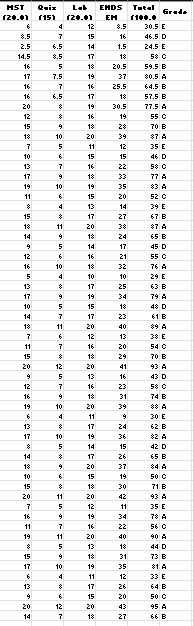

2. Para cada atributo se ordenaron las calificaciones y se reemplazaron por las categorías:

- **L (Low):** rendimiento bajo.
- **M (Medium):** rendimiento medio.
- **H (High):** rendimiento alto.

Como criterio inicial se buscó ubicar aproximadamente al **20 %** de los estudiantes en el nivel bajo, al **60 %** en el nivel medio y al **20 %** en el nivel alto. Cuando varios estudiantes presentaron la misma calificación en un punto de corte, el límite se desplazó para evitar que un mismo valor quedara dividido entre dos categorías.

  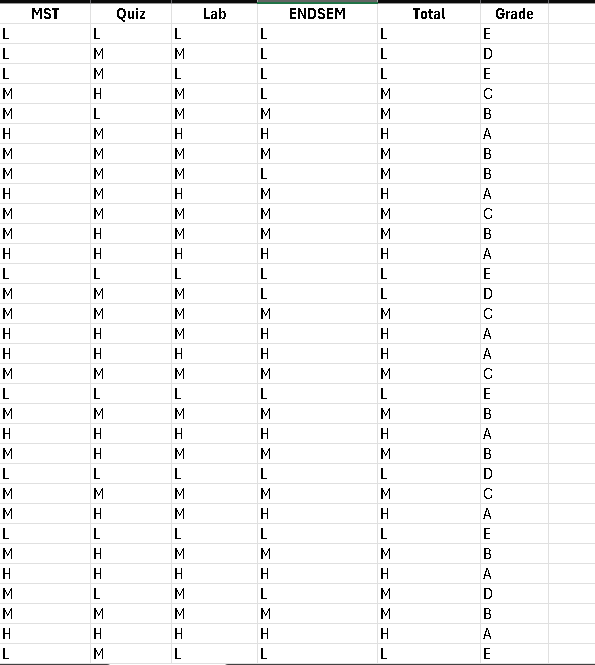

3. El archivo discretizado se guardó en formato CSV y se cargó en Weka. El sistema reconoció los seis atributos como nominales. En el caso de **MST**, la distribución resultante fue:

| Categoría | Cantidad |
|---|---:|
| L | 15 |
| M | 28 |
| H | 17 |

La distribución no es exactamente 12-36-12 porque se respetaron los empates existentes en los puntos de corte.

  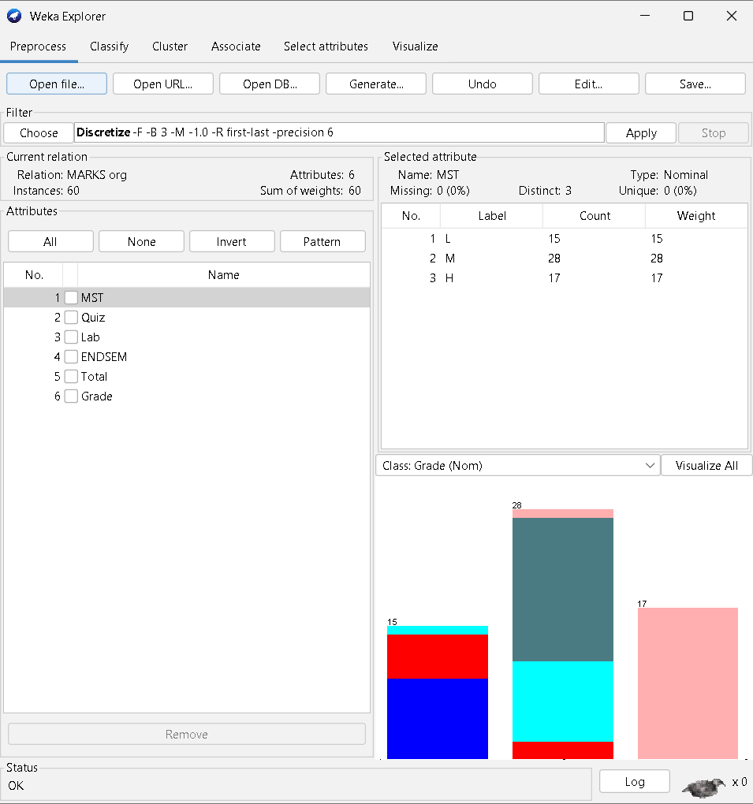

4. En la pestaña **Associate** se seleccionó **PredictiveApriori** con su configuración general, es decir, sin restringir las reglas a la clase **Grade**. Weka analizó asociaciones entre cualquiera de los seis atributos.

  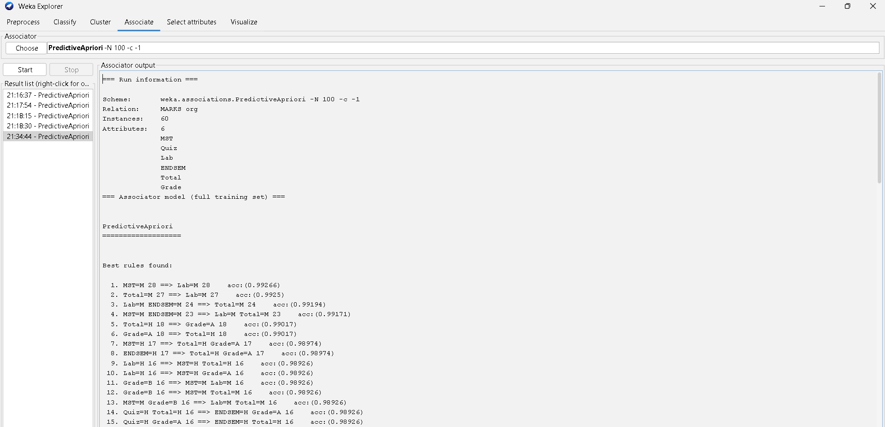

### Análisis de las reglas generales

Las reglas con mayor exactitud predictiva fueron:

| Regla encontrada | Registros | `acc` | Interpretación |
|---|---:|---:|---|
| `MST = M => Lab = M` | 28 | 0.99266 | Todos los estudiantes con MST medio también aparecen con laboratorio medio. |
| `Total = M => Lab = M` | 27 | 0.99250 | El total medio está fuertemente asociado con un desempeño medio en laboratorio. |
| `Lab = M, ENDSEM = M => Total = M` | 24 | 0.99194 | Cuando laboratorio y examen final son medios, el total también es medio. |
| `Total = H => Grade = A` | 18 | 0.99017 | Los 18 estudiantes con total alto obtuvieron una calificación final A. |
| `Grade = A => Total = H` | 18 | 0.99017 | La relación anterior también se presenta en sentido inverso dentro del conjunto analizado. |
| `MST = H => Total = H, Grade = A` | 17 | 0.98974 | Un MST alto se relaciona con total alto y nota final A. |

Estas reglas evidencian que la categoría **M** concentra una gran parte de los estudiantes y, por ello, produce varias asociaciones de alta cobertura. También se observa una relación muy fuerte entre **Total = H** y **Grade = A**, lo cual confirma que la calificación final se encuentra directamente vinculada al total alcanzado.

5. Para obtener únicamente reglas cuyo consecuente sea la calificación final, se abrió la configuración de **PredictiveApriori** y se cambió el parámetro **`car` a `True`**. El último atributo, **Grade**, quedó definido como clase.

  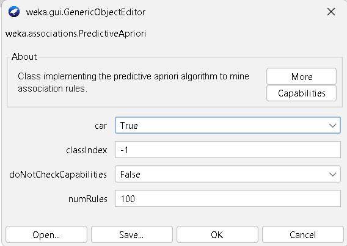

6. Se ejecutó nuevamente el algoritmo. Esta vez todas las reglas generadas tuvieron como resultado una categoría de **Grade**.

  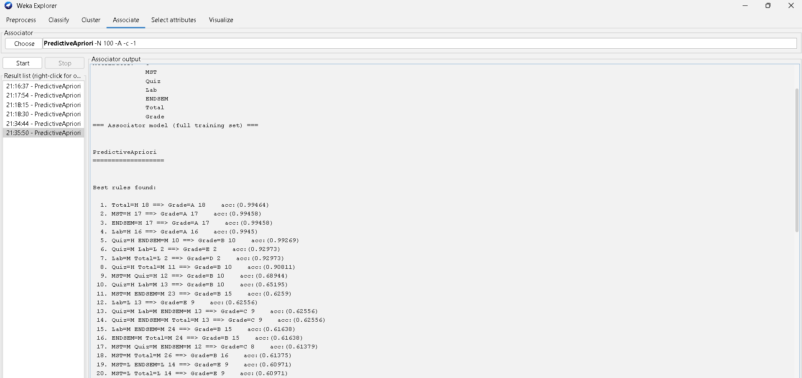

### Análisis de las reglas orientadas a Grade

| Regla encontrada | Resultado | Registros | `acc` |
|---|---|---:|---:|
| `Total = H` | `Grade = A` | 18 de 18 | 0.99464 |
| `MST = H` | `Grade = A` | 17 de 17 | 0.99458 |
| `ENDSEM = H` | `Grade = A` | 17 de 17 | 0.99458 |
| `Lab = H` | `Grade = A` | 16 de 16 | 0.99450 |
| `Quiz = H, ENDSEM = M` | `Grade = B` | 10 de 10 | 0.99269 |
| `Quiz = M, Lab = L` | `Grade = E` | 2 de 2 | 0.92973 |
| `Lab = M, Total = L` | `Grade = D` | 2 de 2 | 0.92973 |

La regla más sólida es **`Total = H => Grade = A`**, debido a que incluye 18 registros y presenta la mayor exactitud predictiva. También se observa que alcanzar un nivel alto en **MST**, **ENDSEM** o **Lab** se relaciona de forma consistente con una nota final A. En cambio, algunas reglas relacionadas con las notas D y E tienen buena exactitud, pero se basan en únicamente dos estudiantes, por lo que su cobertura es reducida.

7. Como análisis adicional, se reemplazaron los valores **M** por el símbolo **`?`**, que Weka interpreta como un valor faltante. El objetivo fue ignorar los casos intermedios y concentrar el análisis en los estudiantes con resultados bajos o altos.

Al volver a cargar el archivo, por ejemplo, el atributo MST presentó **28 valores faltantes**, mientras que permanecieron 15 valores L y 17 valores H.

  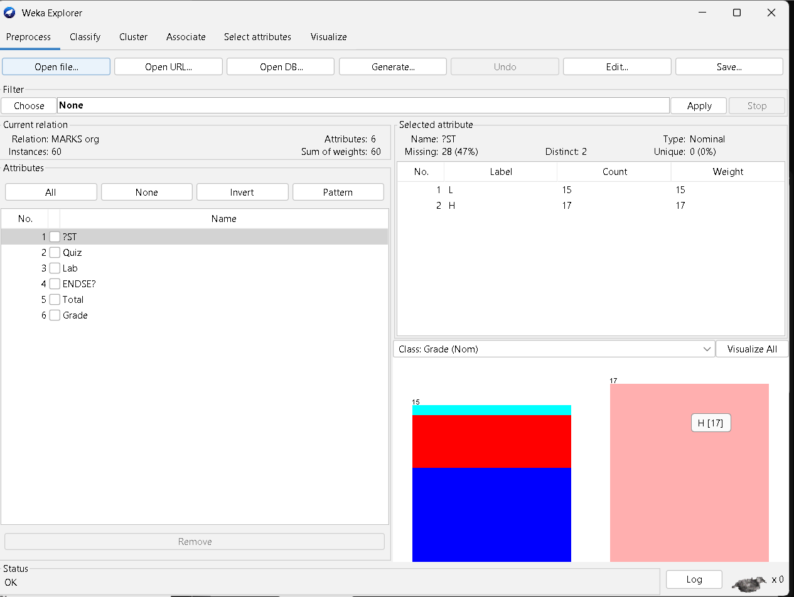

8. Se ejecutó nuevamente **PredictiveApriori** sobre el conjunto modificado.

  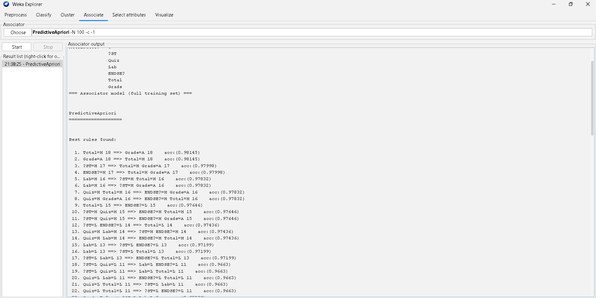

### Análisis del conjunto sin valores medios

Entre las reglas principales se observan:

| Regla encontrada | Registros | `acc` |
|---|---:|---:|
| `Total = H => Grade = A` | 18 | 0.98145 |
| `Grade = A => Total = H` | 18 | 0.98145 |
| `MST = H => Total = H, Grade = A` | 17 | 0.97998 |
| `ENDSEM = H => Total = H, Grade = A` | 17 | 0.97998 |
| `Lab = H => MST = H, Total = H` | 16 | 0.97832 |
| `Total = L => ENDSEM = L` | 15 | 0.97646 |

Al eliminar los valores medios, las reglas se concentran en relaciones de los extremos **L** y **H**, lo que facilita identificar perfiles de rendimiento claramente bajos o altos. No obstante, también se descarta una gran cantidad de información: en MST se ignoran 28 de los 60 registros. Esto explica que la mejor exactitud predictiva de la ejecución general disminuya de **0.99266** con las tres categorías a **0.98145** al omitir la categoría media.

### Conclusión del ejercicio 10.9

La discretización manual permitió aplicar minería de asociaciones sobre calificaciones originalmente numéricas y obtener reglas fáciles de interpretar. Los resultados más importantes muestran que:

- Un **Total alto** está fuertemente asociado con una **calificación A**.
- Los niveles altos de **MST**, **ENDSEM** y **Lab** también se relacionan con una calificación A.
- Las categorías medias generan una gran cantidad de reglas debido a que concentran la mayoría de registros.
- Reemplazar los valores medios por datos faltantes permite estudiar los extremos, pero reduce la cobertura y parte de la exactitud predictiva.

Las asociaciones obtenidas describen patrones presentes en este conjunto de estudiantes; no representan relaciones causales. Para usar estos hallazgos en decisiones académicas sería conveniente analizarlos junto con más periodos, más estudiantes y otras variables relacionadas con el proceso de aprendizaje.
