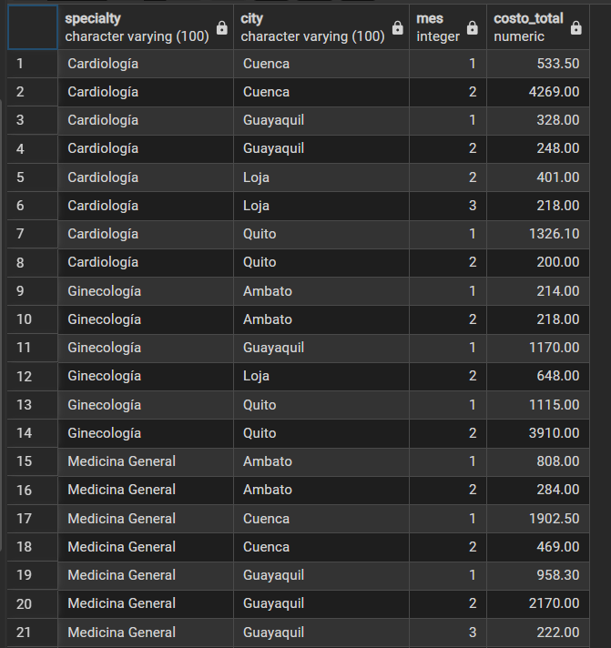
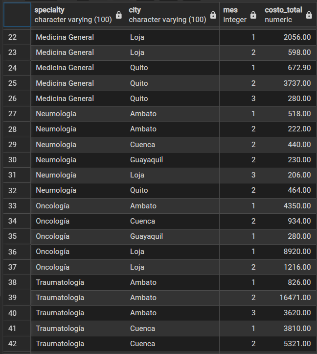
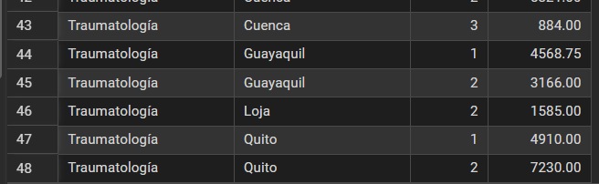
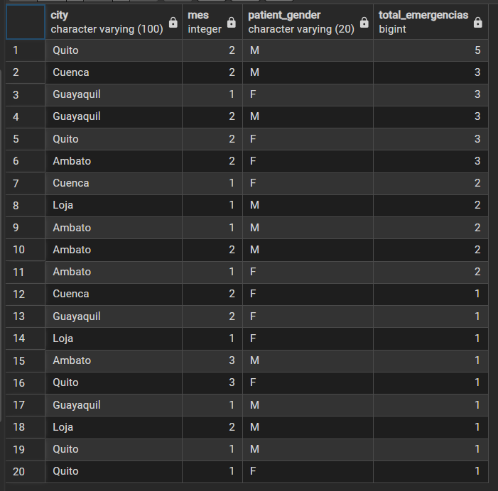
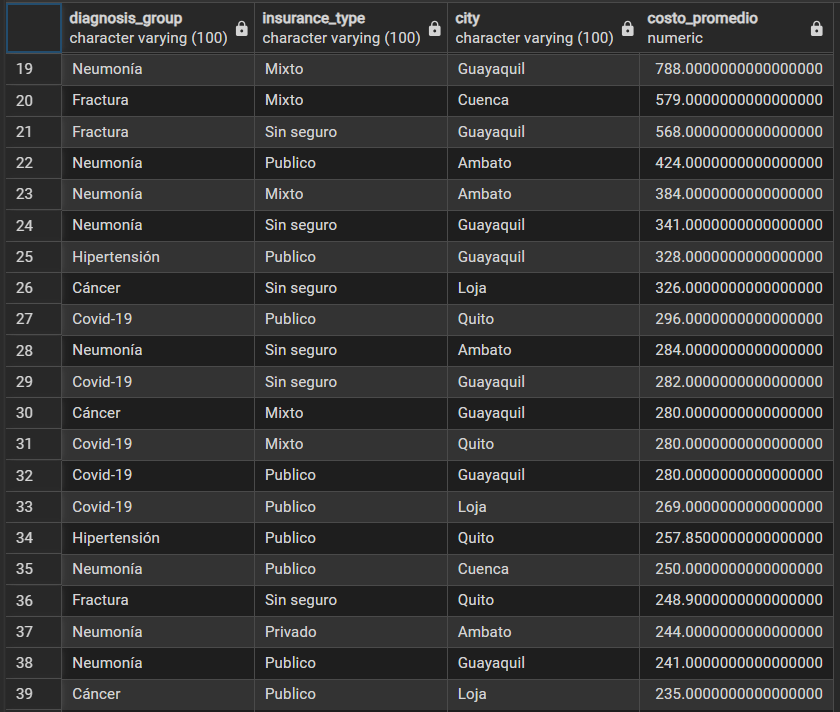
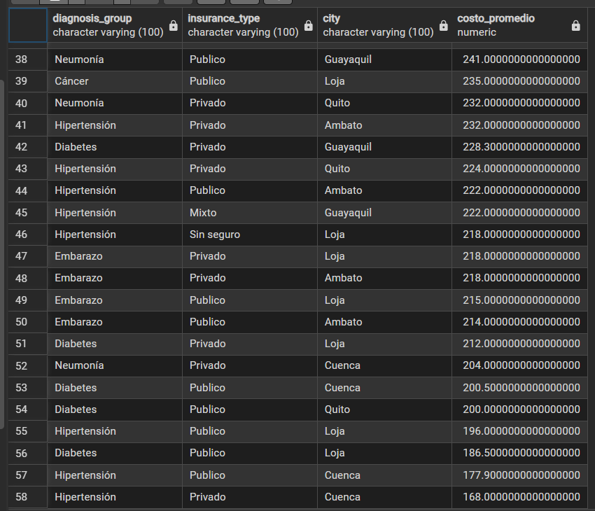

# Informe de Laboratorio: MOLAP

### **Integrantes:**
* Javier Angulo
* Jotcelyn Godoy
* Javier Quilumba
* Cristian Robles
* Jonathan Tipán

---

### **Introducción**
El presente informe documenta la transformación de un conjunto de datos clínicos crudos mediante el diseño de un **Modelo Estrella (Star Schema)** en PostgreSQL. A continuación, se presenta el diagrama conceptual del modelo implementado:

### 📊 Análisis de Costos Hospitalarios

#### ¿Cuál es el costo total de atención por especialidad, ciudad y mes?

A continuación se presenta el desglose de los costos totales acumulados en el Data Warehouse, agrupados por la especialidad médica, la ciudad donde se realizó la atención y el número de mes correspondiente:

#### 🔍 Observaciones Clave del Negocio
* **Mayor impacto financiero:** La especialidad de **Traumatología en Ambato durante el mes 2** registra el costo acumulado más alto de todo el reporte con **$16,471.00**, seguida por **Oncología en Loja (Mes 1)** con **$8,920.00**.
* **Evolución mensual:** Se observa una fuerte concentración y variación de costos entre el mes 1 y el mes 2 en casi todas las ciudades, lo que podría indicar estacionalidad en ciertos tipos de procedimientos o picos de ingresos hospitalarios.

#### ¿Qué ciudad tuvo más emergencias por mes y género?

A continuación se detalla el análisis del volumen de emergencias médicas registradas, ordenadas de mayor a menor frecuencia, desagregadas por ciudad, mes del año y género del paciente:

#### 🔍 Observaciones Clave del Análisis
* **Pico más alto:** La ciudad de **Quito lidera el reporte en el Mes 2 (Febrero)** con un total de **5 emergencias** registradas en pacientes de género masculino (M). 
* **Comportamiento por género:** Durante el Mes 2 se observa la mayor actividad en emergencias en general, destacando que ciudades como Cuenca, Guayaquil y la misma Quito registran una concentración importante de casos en pacientes masculinos, mientras que en Ambato destaca el género femenino en ese mismo periodo.
* **Estabilidad mensual:** El Mes 1 y el Mes 2 concentran casi la totalidad de las incidencias del dataset, mostrando una disminución drástica de casos reportados hacia el Mes 3.

#### ¿Por diagnóstico y tipo de seguro, cuál es el costo promedio por visita y en qué ciudad es más alto?

A continuación se presenta el análisis del costo promedio por visita hospitalaria, ordenado de mayor a menor impacto económico, clasificado por diagnóstico médico, el tipo de cobertura o seguro, y la ciudad correspondiente:

#### 🔍 Observaciones Clave del Análisis
* **Costo Promedio Más Alto:** El promedio por visita más elevado corresponde al diagnóstico de **Cáncer con seguro Mixto en la ciudad de Ambato**, alcanzando un valor de **$4,350.00**.
* **Impacto por diagnóstico (Fracturas):** Las visitas relacionadas con **Fracturas** representan de forma consistente el grupo con los promedios más altos en múltiples ciudades (Quito, Ambato, Cuenca, Guayaquil) bajo distintas coberturas de seguro (Privado y Público), situándose la mayoría por encima de los **$2,200.00**.
* **Efecto de la falta de cobertura:** Los registros clasificados como **"Sin seguro"** muestran, por lo general, los costos promedio más bajos en todo el conjunto de datos (por ejemplo, *Cáncer* en Loja por $326.00 o *Fractura* en Quito por $248.90), lo que podría sugerir subsidios internos o limitaciones en los tipos de procedimientos aplicados a este grupo de pacientes.

---

## Declaración de Uso de Inteligencia Artificial (IA)

De acuerdo con los lineamientos de evaluación, se declara de forma transparente el uso y porcentaje de herramientas de Inteligencia Artificial en el desarrollo de este proyecto:

* **Porcentaje estimado de uso de IA:** 30%
* **Herramienta utilizada:** Gemini (Generative AI de Google).
* **Alcance del uso:** 
  * Asistencia en la resolución de errores sintácticos de importación de datos en PostgreSQL (ajuste de delimitadores para el archivo `salud.csv`).
  * Optimización del formato y estructuración de tablas de resultados analíticos en lenguaje Markdown (.md) para la documentación en GitHub.

*Nota: El diseño del modelo de base de datos, la escritura de las consultas analíticas iniciales en SQL, la creación de la vista materializada y la interpretación de los resultados clínicos fueron realizados y verificados en su totalidad por el autores del informe*
